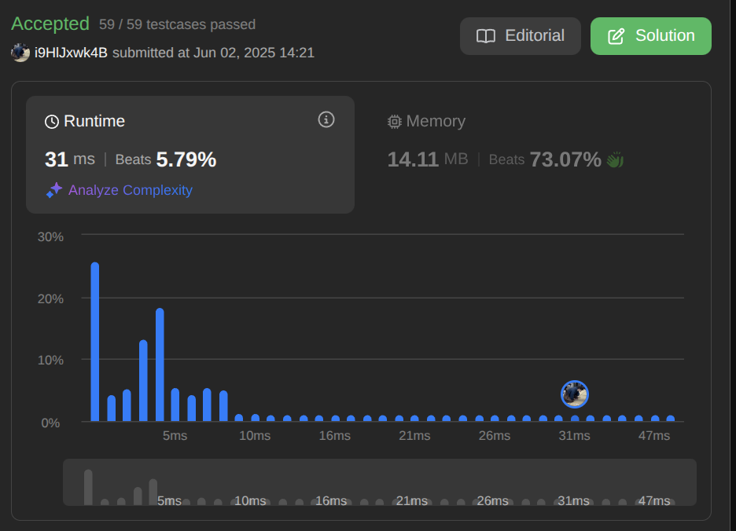

# 287. find-the-duplicate-number

https://leetcode.com/problems/find-the-duplicate-number/description/

## Comments
09:32
空間計算量がO(1)であることがめっちゃだるそう。配列の値をそのまま使う。。。？
2分探索ならうまくいくのかなぁ。
時間計算量はO(nlogn)になって実行可能ではありそう。
空間計算量はO(1)になる。

具体的な二分探索方法
1-n/2の数が、n/2 + 1個あるなら、前半側の数字に重複がある。
逆もしかり。

1 - n/4の数が、n/4 + 1個あるなら、前半側の数字に重複がある。
を繰り返す。

のかなぁ。
再帰でやる？itereationでやる？
iterationでやると、while文の中で配列の値を使うことになるので、ちょっとだるい。
再帰でやるなら、回数を継続していきたい。どうやって引数に渡すのか。
whileで回すほうが楽か。

### step1
```c
// 1. 配列の値をそのまま使う
int findDuplicate(int* nums, int numsSize)
{
	int i;
	int first;

	i = 0;
	first = 0;
	while (i < numsSize)
	{
		if (nums[i] < numsSize / 2)
			first++;
		else
			first--;
		i++;
	}
	if (first > 0)
	{
		// 前半側に重複がある
		return findDuplicate(nums, numsSize / 2);
	}
	else
	{
		// 後半側に重複がある
		return findDuplicate(nums + numsSize / 2, numsSize - numsSize / 2);
	}
}
```
*
うーんnumSizeは固定にしたい。。。
Static変数にして、再帰のたびにnumsSizeを渡すのはどうだろう。

### step2
```c
// 1. 配列の値をそのまま使う
int findDuplicate(int* nums, int numsSize)
{
	int i;
	int first;
	static int numSize_copy = numsSize;

	i = 0;
	first = 0;
	while (i < numsSize_copy)
	{
		if (nums[i] < numsSize / 2)
			first++;
		else
			first--;
		i++;
	}
	if (first > 0)
	{
		// 前半側に重複がある
		return findDuplicate(nums, numsSize / 2);
	}
	else
	{
		// 後半側に重複がある
		return findDuplicate(nums + numsSize / 2, numsSize - numsSize / 2);
	}
}
```
*
いけんちゃうかなぁ。main関数を作成して、テストしてみよう。

```c
#include <stdio.h>

int	main(void)
{
	int nums[] = {1, 2, 3, 3};
	int numsSize = 4;

	printf("%d\n", findDuplicate(nums, numsSize));
	return (0);
}
```
うごかんなぁ。
セグフォがでる。
static変数を仮引数で初期化するのはだめらしい。
なんでなんやろう。
一旦固定値でやろう。
やったけど無理そう。セグフォがでる。
indexとかめんどくさいなぁ。やっぱwhileでやるほうが楽そう。
while文に変更しよう。
### step3
```c

int	findDuplicate(int *nums, int numsSize)
{
	int	left;
	int mid;
	int right;
	int	i;
	int	count;

	left = 0;
	right = numsSize - 1;
	while (left < right)
	{
		mid = (left + right) / 2;
		count = 0;
		i = 0;
		while (i < numsSize)
		{
			if (nums[i] <= mid)
				count++;
			i++;
		}
		if (count > mid)
			right = mid;
		else
			left = mid + 1;
	}
	return (left);
}

#include <stdio.h>

int	main(void)
{
	int nums[] = {1, 2, 4, 5, 3, 2};
	int numsSize = 6;

	printf("%d\n", findDuplicate(nums, numsSize));
	return (0);
}

```
めっちゃきれいに実装できた。
mainのテスト何個か試しても行けた
行けてそう！！

いけた！！
なんかめちゃ早の人たちいる。
何なんやろ。
