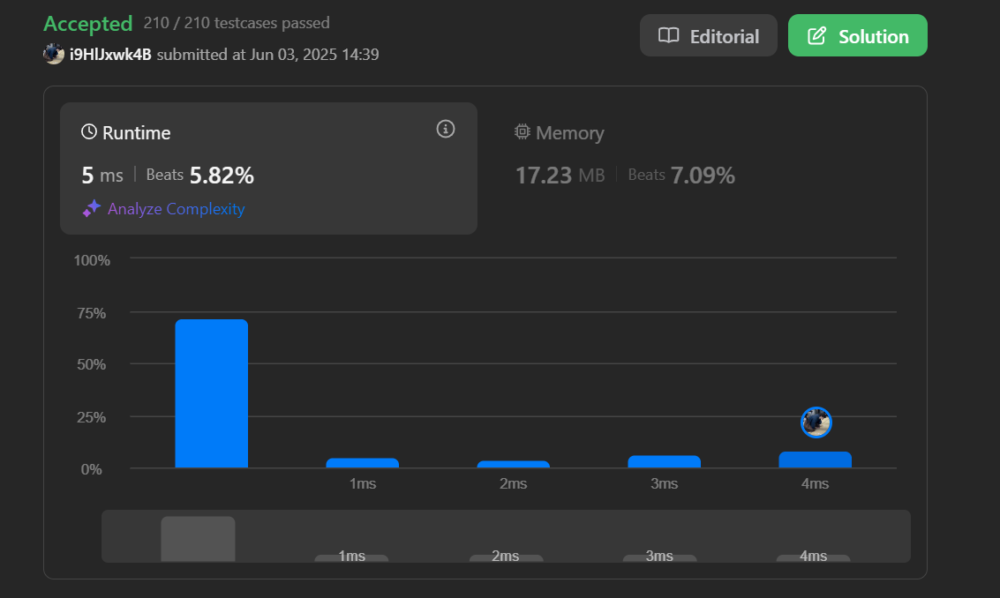
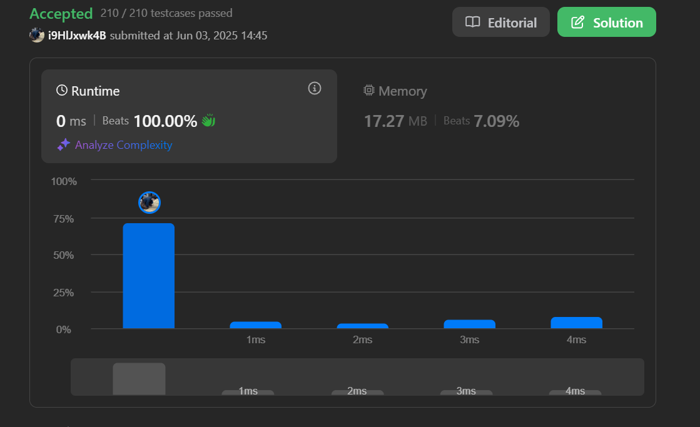

# 53. maximum-subarray

https://leetcode.com/problems/maximum-subarray/description/

## Comments
最大値を求める問題か。  
全ての部分配列を求めて、最大値を求めるのはO(n^2)かな。  
流石に無理そう。

Inputの数は、10^5までやし、  
O(n^2)ではなくて、O(n)で求める必要があるなぁ。  

Maxを求める方法は？  
まずは、1個1個のマスに対して、最大値を求める。  
最大値は、前のマスの最大値（自分自身を除く）OR 自分自身を含めた部分列の和、の2択かな。

もっと具体的に考えると、1個1個のマスに対して、最大値を求める方法は、
1. そのマスを含む部分配列の最大値を求める。
2. そのマスを含まない部分配列の最大値を求める。
3. そのマスを含む部分配列の最大値と、含まない部分配列の最大値を比較して、最大値を求める。

直前の値を利用するのなら動的計画法かな。  
一旦まずは、dpにcopyした方が楽そう？  
実装できそうやし手を動かしてみよう。


Main関数で何個かテストしてみたところ、あってそうな感じする。提出してみよう。  



OK!  
けど計算時間もうちょい短く出来そう？  
memcopyとdpと最大値で3回ループしてるからか。  

1週に減らせへんかなぁ。  
とりあえず、memcopyは必要無さそうか。  
んで、下のwhile文は、一回目に統合しよう。



できた！  
けど可読性は少し悪くなったかぁ。  
これなら前の実装の方が良いかも。  
てか、これmemcopyしてるのと同じか？？

memory量もすこし減らせそう。dp配列2つしか使用してないし。

```c
int	maxSubArray(int *nums, int numsSize)
{
	int *dp;
	int i;
	int max_sum;

	dp = malloc(sizeof(int) * 2);
	if (!dp)
		return (0);
	dp[0] = nums[0];
	max_sum = dp[0];
	i = 1;
	while (i < numsSize)
	{
		dp[1] = nums[i];
		if (dp[1] < dp[0] + nums[i])
			dp[1] = dp[0] + nums[i];
		if (max_sum < dp[1])
			max_sum = dp[1];
		dp[0] = dp[1];
		i++;
	}
	free(dp);
	return (max_sum);
}
```


うーん。  
改善できたけど、可読性は悪くなった。  
他の人の答案を見てみよう。  

命名の仕方いい人見つけた。  
dpって命名良くないな。意味を込めたほうが良さそう。  
あと、直前の値（dp[0]）もいらんのかなぁ。  

```c
int maxSubArray(int* nums, int numsSize) {
    int currentSum = nums[0];
    int maxSum = nums[0];
    for (int i = 1; i < numsSize; i++) {
        if (currentSum < 0)
            currentSum = nums[i];
        else
            currentSum += nums[i];
        
        if (currentSum > maxSum)
            maxSum = currentSum;
    }
    return maxSum;
}
```
参考にしたコード。

なんでこれでいけんのや？？  
直前の値が負なら場合分け。  
うーん。いまいち分からん。  
ChatGPTに聞いてみるか。

```md
### 何をしているコードか ―― “最大部分配列問題” の高速解（Kadane 法）

与えられた整数配列 `nums` の **連続した区間のうち、要素の合計が最大になるもの** を 1 回の走査で求めています。
ポイントは

| 変数           | 役割                              |
| ------------ | ------------------------------- |
| `currentSum` | **いま見ている位置 i を終点とする区間**で取り得る最大和 |
| `maxSum`     | これまでに見つかった **全区間のうちの最大和**       |

---

## 行ごとの意味

```c
int currentSum = nums[0];    // 最初の区間は要素0だけ
int maxSum     = nums[0];

for (int i = 1; i < numsSize; i++) {
    /* 直前までの区間が負なら、拡張すると必ず損をする */
    if (currentSum < 0)
        currentSum = nums[i];   // 区間をリセット（ここから新しく始める）
    else
        currentSum += nums[i];  // 区間をそのまま右へ 1 要素伸ばす

    /* ここまでで得られた最大値を更新 */
    if (currentSum > maxSum)
        maxSum = currentSum;
}
return maxSum;


---

## “なぜ負ならリセット？” を直感で

* 連続区間の末尾に新しい要素 `nums[i]` を足すとき、
  もし **直前の合計 `currentSum` が負** なら
  `currentSum + nums[i] < nums[i]` が必ず成り立つ ⟶ *必ず悪化*
  → だったら “マイナスごと切り捨てて” `nums[i]` からやり直す方が得。
* 正の合計を持っていれば、伸ばした方が大きくなる *可能性* があるので、そのまま足す。

---

## 具体例シミュレーション

配列 `[-2, 1, -3, 4, -1, 2, 1, -5, 4]` を手で追うと：

| i | nums\[i] | currentSum の計算        | currentSum | maxSum |
| - | -------- | --------------------- | ---------- | ------ |
| 0 | -2       | 初期値                   | **-2**     | **-2** |
| 1 | 1        | -2 < 0 → リセット → 1     | 1          | 1      |
| 2 | -3       | 1 ≥ 0 → 1 + (-3) = -2 | -2         | 1      |
| 3 | 4        | -2 < 0 → リセット → 4     | 4          | **4**  |
| 4 | -1       | 4 ≥ 0 → 4 + (-1) = 3  | 3          | 4      |
| 5 | 2        | 3 ≥ 0 → 3 + 2 = 5     | 5          | **5**  |
| 6 | 1        | 5 ≥ 0 → 5 + 1 = 6     | 6          | **6**  |
| 7 | -5       | 6 ≥ 0 → 6 + (-5) = 1  | 1          | 6      |
| 8 | 4        | 1 ≥ 0 → 1 + 4 = 5     | 5          | 6      |

最終結果 `maxSum = 6`（区間 `[4, -1, 2, 1]`）。

---

## 性能

* **時間計算量**：O(N) ― 配列を 1 回なめるだけ
* **追加メモリ**：O(1) ― 変数 2 つだけ

---

## より読みやすく書き換える例

```c
int maxSubArray(int *a, int n) {
    int best  = a[0];
    int here  = a[0];

    for (int i = 1; i < n; ++i) {
        here = (here < 0) ? a[i] : here + a[i];
        best = (best < here) ? here : best;
    }
    return best;
}

同じ考え方で、全要素が負でも安全に動きます。
理解の助けになれば幸いです！
```


なるほど！！  
めっちゃ単純な話で、直前が負なら、足した結果は必ず元の数字より小さくなるもんな。

Step3に再実装しといた。  
まあほぼfor文をwhile文に変えただけやけど。

